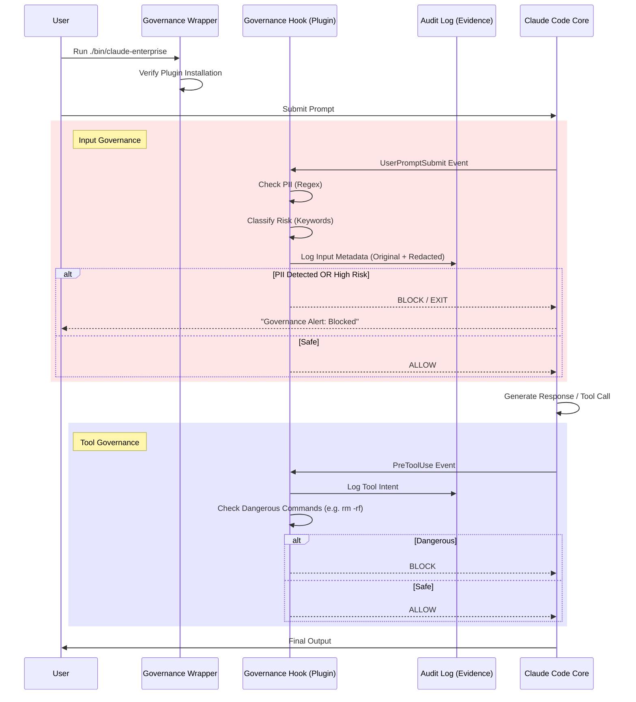

# Enterprise AI Governance Framework

This directory contains the documentation and tools required to operate Claude Code as a compliant AI System (AIS) under **ISO/IEC 42001** and the **EU AI Act**.

## Governance Architecture

The governance model in this fork is achieved through a mandatory **Interception Layer** that wraps the core Claude Code execution. This layer enforces policies *before* the model receives input and *after* the model generates tool calls or output.

### Governance Flow Diagram

## Evidence Gathering

To satisfy external auditors (ISO 42001) or regulatory bodies (EU AI Act), the following evidence artifacts are generated automatically or managed via this framework:

| Requirement | Evidence Source | Location |
| :--- | :--- | :--- |
| **Traceability** | Immutable Audit Logs | `~/.claude/governance_audit.log` |
| **Risk Management** | Risk Assessment Records | `governance/RISK_ASSESSMENT_TOOL.md` (Filled) |
| **Transparency** | System Declaration | `governance/TRANSPARENCY_INFO.md` |
| **Human Oversight** | Intervention Logs | `governance_audit.log` (Look for `BLOCK` decisions) |
| **Data Governance** | PII Detection Logs | `governance_audit.log` (Event: `INPUT_CHECK`) |

### How to Extract Evidence
1.  **Audit Logs:** The JSON-lines format in `~/.claude/governance_audit.log` can be ingested into SIEM tools (Splunk, Datadog) or parsed via script to generate compliance reports.
2.  **Policy Documents:** Maintain version-controlled copies of the Markdown files in this directory. Changes to `AI_POLICY.md` should be treated as policy updates.

## Suggestive Actions for Enterprise Governance Teams

To further enhance trackability and enforce safe internal usage, we recommend the following actions:

### 1. Enhance Traceability & Identity
*   **Integrate SSO:** Modify the `governance_hook.py` to pull user identity from the environment (e.g., `USER` or custom JWT tokens) and include it in every audit log entry.
*   **Session Tagging:** Enforce a strict `Project-ID` tag in the wrapper script to attribute costs and risks to specific business units.

### 2. Advanced PII Enforcement
*   **Custom NER Models:** Replace the regex-based `check_pii` function in `plugins/governance-layer/hooks/governance_hook.py` with a local NLP model (e.g., Microsoft Presidio or generic BERT-NER) for higher accuracy redaction.
*   **Data Loss Prevention (DLP) Integration:** Configure the hook to send payloads to your corporate DLP API before allowing them to proceed to Claude.

### 3. Automated Evidence Collection
*   **Cron Job:** Set up a daily job to archive `governance_audit.log` to cold storage (WORM - Write Once Read Many) to prevent tampering, satisfying ISO 42001 Record Control requirements.
*   **Dashboarding:** Build a simple dashboard using the log data to visualize "Blocked High-Risk Prompts" vs "Allowed Low-Risk Prompts" to demonstrate active oversight to auditors.

### 4. Human-in-the-Loop (HITL)
*   **Approval Workflow:** For High-Risk use cases, extend the `governance_hook.py` to trigger a Slack/Teams approval request. The hook would wait (poll) for an external approval signal before returning `exit 0` to Claude.

## Compliance Checklist
- [ ] **AI Policy** defined and accessible (`AI_POLICY.md`).
- [ ] **Risk Assessment** completed for the specific deployment (`RISK_ASSESSMENT_TOOL.md`).
- [ ] **Governance Plugin** installed and verified active.
- [ ] **Audit Logging** verified (check `~/.claude/governance_audit.log` after test run).
